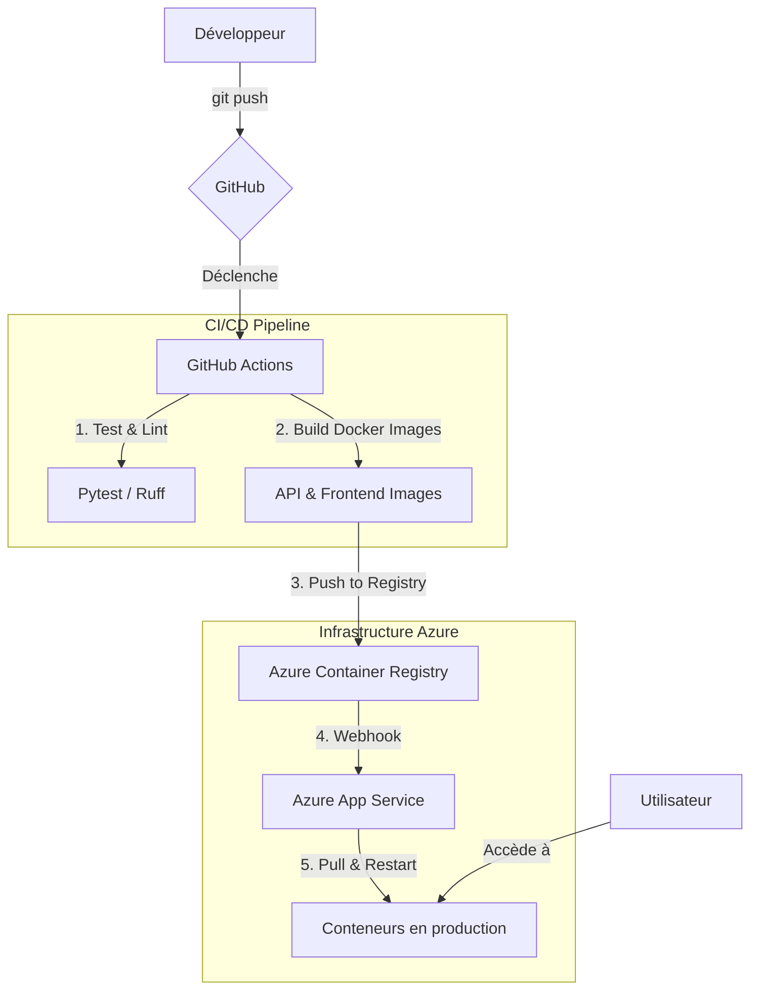

# Détection de Bad Buzz 🧠✨

[!CI/CD Pipeline](https://github.com/emmanuelouedraogo/Badbuzz_detection/actions/workflows/ci-cd.yml)

Une application web complète pour l'analyse de sentiments, capable de classifier un texte en **Positif** ou **Négatif** à l'aide d'un modèle de Deep Learning. Ce projet est entièrement conteneurisé avec Docker et déployé automatiquement sur Azure via un pipeline CI/CD avec GitHub Actions.

<!-- !Aperçu de l'application -->

---

### Table des matières

- À propos du projet
- Stack Technologique
- Architecture
- Structure du projet
- Démarrage rapide (Local)
- Déploiement (CI/CD sur Azure)
- Documentation de l'API
- Contribuer
- Licence
- Contact

---

## À propos du projet

Ce projet met en œuvre une solution de détection de "bad buzz" en analysant le sentiment de textes fournis par l'utilisateur. Il est composé de deux services principaux :

1. **Une API backend (Flask)** : Elle expose un modèle de Deep Learning (un GRU bidirectionnel) entraîné pour la classification de texte. L'API reçoit un texte et retourne une prédiction (Positif/Négatif) ainsi qu'un score de confiance.
2. **Une interface frontend (Streamlit)** : Une application web simple et interactive qui permet aux utilisateurs de saisir du texte et de visualiser instantanément le résultat de l'analyse de sentiment.

L'ensemble du projet est conçu pour être robuste, scalable et facilement déployable grâce à la conteneurisation Docker et à un pipeline d'intégration et de déploiement continus (CI/CD).

## Stack Technologique

- **Backend**: Python, Flask, Gunicorn
- **Frontend**: Streamlit
- **Machine Learning**: TensorFlow/Keras, Gensim
- **Conteneurisation**: Docker, Docker Compose
- **CI/CD**: GitHub Actions
- **Cloud & Hébergement**: Microsoft Azure (App Service, Container Registry)

## Architecture

Le schéma ci-dessous illustre le flux de déploiement automatisé, du push sur GitHub jusqu'à la mise en production sur Azure App Service.



## Structure du projet

```
badbuzz_detection/
├── .github/workflows/ci-cd.yml      # Pipeline CI/CD avec GitHub Actions
├── .dockerignore                      # Fichiers à ignorer par Docker
├── .gitignore                         # Fichiers à ignorer par Git
├── api.Dockerfile                     # Instructions pour construire l'image de l'API
├── app.py                             # Code source de l'API Flask
├── azure-sidecar-config.json          # Configuration pour Azure App Service (Sidecar)
├── docker-compose.yml                 # Composition pour le développement local
├── frontend.Dockerfile                # Instructions pour construire l'image du frontend
├── README.md                          # Ce fichier
├── requirements-dev.txt               # Dépendances pour le développement et les tests
├── requirements.txt                   # Dépendances de production (API & Frontend)
├── streamlit_app.py                   # Code source du frontend Streamlit
└── test_app.py                        # Tests unitaires pour l'API
```

## 🚀 Démarrage rapide (Local)

Suivez ces étapes pour lancer le projet sur votre machine en utilisant Docker.

### Prérequis

- Git
- Docker
- Docker Compose

### Installation et Lancement

1. **Cloner le dépôt :**

    ```bash
    git clone https://github.com/emmanuelouedraogo/Badbuzz_detection.git
    cd Badbuzz_detection
    ```

2. **Configurer les variables d'environnement :**
    Créez un fichier `.env` à la racine du projet en vous basant sur le fichier `.env.example` (s'il existe) ou en copiant le contenu ci-dessous. Les URLs sont déjà pré-remplies.

    ```shell
    # .env
    MODEL_URL="https://github.com/emmanuelouedraogo/Badbuzz_detection/releases/download/v1.0.0/best_gensim_bidirectional_gru_en_model.keras"
    TOKENIZER_URL="https://github.com/emmanuelouedraogo/Badbuzz_detection/releases/download/v1.0.0/tokenizer.pickle"
    API_URL="http://127.0.0.1:5000/predict"
    ```

3. **Lancer avec Docker Compose :**
    Cette commande va construire les images Docker pour l'API et le frontend, puis démarrer les conteneurs.

    ```bash
    docker-compose up --build
    ```

4. **Accéder à l'application :**
    Ouvrez votre navigateur et allez à l'adresse suivante :
    **<http://localhost:8501>**

## ☁️ Déploiement (CI/CD sur Azure)

Le déploiement est entièrement automatisé grâce à GitHub Actions et Azure App Service.

### Prérequis

- Un compte Microsoft Azure
- Azure CLI installé ou utilisation du Cloud Shell
- Un compte GitHub

### Étape 1 : Configuration des secrets sur GitHub

Allez dans les paramètres de votre dépôt GitHub (`Settings > Secrets and variables > Actions`) et ajoutez les secrets suivants :

- `ACR_LOGIN_SERVER` : L'URL de votre Azure Container Registry (ex: `monacr.azurecr.io`).
- `ACR_USERNAME` : Le nom d'utilisateur pour se connecter à l'ACR.
- `ACR_PASSWORD` : Le mot de passe pour se connecter à l'ACR.
- `MODEL_URL` : L'URL de téléchargement de votre modèle `.keras`.
- `TOKENIZER_URL` : L'URL de téléchargement de votre tokenizer `.pickle`.

### Étape 2 : Création de l'infrastructure sur Azure

Utilisez le **Cloud Shell** sur le portail Azure pour exécuter les commandes suivantes.

1. **Créer le groupe de ressources :**

    ```bash
    az group create --name BadbuzzResourceGroup --location "West Europe"
    ```

2. **Créer le registre de conteneurs (ACR) :**
    *(Choisissez un nom unique pour `badbuzzacrunique`)*

    ```bash
    az acr create --resource-group BadbuzzResourceGroup --name badbuzzacrunique --sku Basic --admin-enabled true
    ```

3. **Créer le plan App Service :**

    ```bash
    az appservice plan create --name BadbuzzAppServicePlan --resource-group BadbuzzResourceGroup --sku B1 --is-linux
    ```

4. **Créer l'application web :**
    *(Nous utilisons une image placeholder comme `nginx` qui sera immédiatement remplacée)*
    ```bash
    az webapp create --resource-group BadbuzzResourceGroup --plan BadbuzzAppServicePlan --name badbuzz-webapp --image nginx
    ```

5. **Configurer les conteneurs (sidecar) :**
    *(Cette commande utilise le fichier `azure-sidecar-config.json`)*
    ```bash
    az webapp config set --resource-group BadbuzzResourceGroup --name badbuzz-webapp --generic-configurations @azure-sidecar-config.json
    ```

6. **Configurer la connexion à l'ACR :**
    ```bash
    az webapp config container set \
        --name badbuzz-webapp \
        --resource-group BadbuzzResourceGroup \
        --docker-registry-server-url "https://$(az acr show --name badbuzzacrunique --query loginServer -o tsv)" \
        --docker-registry-server-user "$(az acr credential show --name badbuzzacrunique --query username -o tsv)" \
        --docker-registry-server-password "$(az acr credential show --name badbuzzacrunique --query passwords[0].value -o tsv)"
    ```

7. **Activer le déploiement continu (CD) :**

    ```bash
    az webapp deployment container config --enable-cd true --name badbuzz-webapp --resource-group BadbuzzResourceGroup
    ```

### Étape 3 : Déclencher le déploiement

Poussez simplement vos modifications sur la branche `main` de votre dépôt GitHub.

```bash
git push origin main
```

Le pipeline GitHub Actions va automatiquement :

1. Lancer les tests.
2. Construire les images Docker.
3. Pousser les images sur votre Azure Container Registry.
4. Azure App Service détectera les nouvelles images et mettra à jour l'application.

Votre application sera accessible après quelques minutes à l'adresse `http://badbuzz-webapp.azurewebsites.net`.

## 📚 Documentation de l'API

### Endpoint de prédiction

- **URL** : `/predict`
- **Méthode** : `POST`
- **Description** : Analyse le sentiment du texte fourni.

#### Requête

* **Headers** : `Content-Type: application/json`
- **Body** (raw JSON) :

  ```json
  {
    "text": "This was a fantastic experience!"
  }
  ```

#### Réponse (Succès)

* **Code** : `200 OK`
- **Body** :

  ```json
  {
    "prediction": "Positive",
    "confidence_score": 0.0123
  }
  ```

  *Note : Le `confidence_score` est le score brut du modèle. Un score proche de 0 est "Positif", un score proche de 1 est "Négatif".*

## 🤝 Contribuer

Les contributions sont ce qui rend la communauté open source un endroit incroyable pour apprendre, inspirer et créer. Toute contribution que vous faites est **grandement appréciée**.

1. Forkez le projet
2. Créez votre branche de fonctionnalité (`git checkout -b feature/AmazingFeature`)
3. Commitez vos changements (`git commit -m 'Add some AmazingFeature'`)
4. Poussez vers la branche (`git push origin feature/AmazingFeature`)
5. Ouvrez une Pull Request

## 📜 Licence

Distribué sous la licence KAIZO. Voir `LICENSE` for for more information.

## ✉️ Contact

Emmanuel OUEDRAOGO - <emmanuelrhema.amjc@gmail.com>

Lien du projet : <https://github.com/emmanuelouedraogo/Badbuzz_detection>
