# Détection de Bad Buzz 🧠✨

<p align="center">
  <a href="https://github.com/emmanuelouedraogo/badbuzz-detection/actions/workflows/ci-cd.yml"></a>
  
  
  
</p>

Une application web complète pour l'analyse de sentiments, capable de classifier un texte en **Positif** ou **Négatif** à l'aide d'un modèle de Deep Learning. Ce projet est entièrement conteneurisé avec Docker et déployé automatiquement sur Azure via un pipeline CI/CD avec GitHub Actions.

<p align="center">
  <!-- Remplacer par une capture d'écran ou un GIF de l'application -->
  
</p>

---

### Table des matières

- [🎯 À propos du projet](#-à-propos-du-projet)
- [🛠️ Stack Technologique](#️-stack-technologique)
- [🏗️ Architecture](#️-architecture)
- [📂 Structure du projet](#-structure-du-projet)
- [🚀 Démarrage rapide (Local)](#-démarrage-rapide-local)
- [☁️ Déploiement (CI/CD sur Azure)](#️-déploiement-ci-cd-sur-azure)
- [📚 Documentation de l'API](#-documentation-de-lapi)
- [🤝 Contribuer](#-contribuer)
- [📜 Licence](#-licence)
- [✉️ Contact](#️-contact)

---

## 🎯 À propos du projet

Ce projet met en œuvre une solution de détection de "bad buzz" en analysant le sentiment de textes fournis par l'utilisateur. Il est composé de deux services principaux :

1. **Une API backend (Flask)** : Elle expose un modèle de Deep Learning (un GRU bidirectionnel) entraîné pour la classification de texte. L'API reçoit un texte et retourne une prédiction (Positif/Négatif) ainsi qu'un score de confiance.
2. **Une interface frontend (Streamlit)** : Une application web simple et interactive qui permet aux utilisateurs de saisir du texte et de visualiser instantanément le résultat de l'analyse de sentiment.

L'ensemble du projet est conçu pour être robuste, scalable et facilement déployable grâce à la conteneurisation Docker et à un pipeline d'intégration et de déploiement continus (CI/CD).

## 🛠️ Stack Technologique

| Catégorie           | Technologies                                                              |
| ------------------- | ------------------------------------------------------------------------- |
| **Backend**         |    |
| **Frontend**        |                                                               |
| **Machine Learning**|   |
| **Conteneurisation**|                                                                   |
| **CI/CD & Cloud**   |   |

## 🏗️ Architecture

Le schéma ci-dessous illustre le flux de déploiement automatisé, du push sur GitHub jusqu'à la mise en production sur Azure App Service.

```mermaid
graph TD
    A[Développeur] -- git push --> B{GitHub};
    B -- Déclenche --> C[GitHub Actions];
    C -- 1. Test & Lint --> D[Pytest / Ruff];
    C -- 2. Build Docker Images --> E[API & Frontend Images];
    E -- 3. Push to Registry --> F[Azure Container Registry];
    F -- 4. Webhook --> G[Azure App Service];
    G -- 5. Pull & Restart --> H[Conteneurs en production];
    I[Utilisateur] -- Accède à --> H;

    subgraph "CI/CD Pipeline"
        C
        D
        E
    end

    subgraph "Infrastructure Azure"
        F
        G
        H
    end
```



## Structure du projet

```
badbuzz_detection/
├── .github/workflows/ci-cd.yml      # Pipeline CI/CD avec GitHub Actions
├── .dockerignore                      # Fichiers à ignorer par Docker
├── .gitignore                         # Fichiers à ignorer par Git
├── api.Dockerfile                     # Instructions pour construire l'image de l'API
├── app.py                             # Code source de l'API Flask
├── docker-compose-azure.yml           # Composition pour le déploiement sur Azure
├── docker-compose.yml                 # Composition pour le développement local
├── frontend.Dockerfile                # Instructions pour construire l'image du frontend
├── README.md                          # Ce fichier
├── requirements-dev.txt               # Dépendances pour le développement et les tests
├── requirements.txt                   # Dépendances de production (API)
├── requirements-frontend.txt          # Dépendances de production (Frontend)
├── streamlit_app.py                   # Code source du frontend Streamlit
└── test_app.py                        # Tests unitaires pour l'API
```

## 🚀 Démarrage rapide (Local)

Suivez ces étapes pour lancer le projet sur votre machine en utilisant Docker.

### Prérequis

- Git
- Docker
- Docker Compose

### Installation et Lancement

1. **Cloner le dépôt :**

    ```bash
    git clone https://github.com/emmanuelouedraogo/badbuzz-detection.git
    cd badbuzz-detection
    ```

2. **Configurer les variables d'environnement :**
    Créez un fichier `.env` à la racine du projet en vous basant sur le fichier `.env.example` (s'il existe) ou en copiant le contenu ci-dessous. Les URLs sont déjà pré-remplies.

    ```shell
    # .env
    MODEL_URL="https://github.com/emmanuelouedraogo/badbuzz-detection/releases/download/v1.0.0/best_gensim_bidirectional_gru_en_model.keras"
    TOKENIZER_URL="https://github.com/emmanuelouedraogo/badbuzz-detection/releases/download/v1.0.0/tokenizer.pickle"
    API_URL="http://127.0.0.1:5000/predict"
    ```

3. **Lancer avec Docker Compose :**
    Cette commande va construire les images Docker pour l'API et le frontend, puis démarrer les conteneurs.

    ```bash
    docker-compose up --build
    ```

4. **Accéder à l'application :**
    Ouvrez votre navigateur et allez à l'adresse suivante :
    **<http://localhost:8501>**

## ☁️ Déploiement (CI/CD sur Azure)

Le déploiement est entièrement automatisé grâce à GitHub Actions et Azure App Service.

### Prérequis

- Un compte Microsoft Azure
- Azure CLI installé ou utilisation du Cloud Shell
- Un compte GitHub

### Étape 1 : Configuration des secrets sur GitHub

Allez dans les paramètres de votre dépôt GitHub (`Settings > Secrets and variables > Actions`) et ajoutez les secrets suivants :

- `ACR_LOGIN_SERVER` : L'URL de votre Azure Container Registry (ex: `monacr.azurecr.io`).
- `ACR_USERNAME` : Le nom d'utilisateur pour se connecter à l'ACR.
- `ACR_PASSWORD` : Le mot de passe pour se connecter à l'ACR.
- `MODEL_URL` : L'URL de téléchargement de votre modèle `.keras`.
- `TOKENIZER_URL` : L'URL de téléchargement de votre tokenizer `.pickle`.
- `AZURE_CREDENTIALS` : Le JSON d'authentification pour le principal de service.

#### Récupération des valeurs pour les secrets

Une fois l'infrastructure créée (étape 2 ci-dessous), vous pouvez récupérer les valeurs pour les secrets avec les commandes suivantes dans le Cloud Shell :

```bash
# Assurez-vous que la variable ACR_NAME est définie avec le nom que vous avez choisi
ACR_NAME="badbuzzacr"

# Pour ACR_LOGIN_SERVER
az acr show --name $ACR_NAME --query loginServer -o tsv

# Pour ACR_USERNAME
az acr credential show --name $ACR_NAME --query username -o tsv

# Pour ACR_PASSWORD
az acr credential show --name $ACR_NAME --query "passwords[0].value" -o tsv

# --- Pour AZURE_CREDENTIALS ---
# 1. Récupérer votre ID de souscription
SUBSCRIPTION_ID=$(az account show --query id -o tsv)

# 2. Définir le nom de votre groupe de ressources
RESOURCE_GROUP="badbuzzresourcegroup"

# 3. Créer le principal de service (copiez l'intégralité du JSON de sortie)
az ad sp create-for-rbac --name "badbuzz-github-actions" --role contributor \
                         --scopes /subscriptions/$SUBSCRIPTION_ID/resourceGroups/$RESOURCE_GROUP \
                         --sdk-auth
```

Les secrets `MODEL_URL` et `TOKENIZER_URL` sont obtenus en créant une **Release** sur votre dépôt GitHub et en copiant les URLs de téléchargement des fichiers de modèle et de tokenizer.

### Étape 2 : Création de l'infrastructure sur Azure

Utilisez le **Cloud Shell** sur le portail Azure pour exécuter les commandes suivantes. Pour rendre les commandes réutilisables et plus faciles à gérer, nous définissons d'abord les noms de nos ressources dans des variables.

```bash
# --- Définir les variables pour les noms de ressources ---
# (Modifiez ces valeurs si vous utilisez des noms différents)
RESOURCE_GROUP="badbuzzresourcegroup"
ACR_NAME="badbuzzacr"
APP_SERVICE_PLAN="badbuzzappserviceplan"
WEBAPP_NAME="badbuzz-webapp"
LOCATION="westeurope"
```

1. **Créer le groupe de ressources :**
    ```bash
    az group create --name $RESOURCE_GROUP --location $LOCATION
    ```

2. **Créer le registre de conteneurs (ACR) :**
    ```bash
    az acr create --resource-group $RESOURCE_GROUP --name $ACR_NAME --sku Basic --admin-enabled true
    ```

3. **Créer le plan App Service :**
    *(Note : Le plan `S1` (Standard) est requis pour utiliser les slots de déploiement. Le plan `B1` n'est pas suffisant.)*
    ```bash
    az appservice plan create --name $APP_SERVICE_PLAN --resource-group $RESOURCE_GROUP --sku S1 --is-linux
    ```

4. **Créer l'application web :**
    *(Nous utilisons une image placeholder comme `nginx` qui sera immédiatement remplacée)*
    ```bash
    az webapp create --resource-group $RESOURCE_GROUP --plan $APP_SERVICE_PLAN --name $WEBAPP_NAME --deployment-container-image-name nginx
    ```

5. **Créer le slot de déploiement "staging" :**
    *(Cet environnement de pré-production est utilisé par le pipeline CI/CD pour tester les changements avant la mise en production.)*

    ```bash
    az webapp deployment slot create --name $WEBAPP_NAME --resource-group $RESOURCE_GROUP --slot staging
    ```

6. **Configurer les conteneurs (multi-conteneurs) :**
    *(Cette commande utilise le fichier `docker-compose-azure.yml` pour configurer les conteneurs. Créez ce fichier s'il n'existe pas, en vous basant sur la section "Architecture".)*
    ```bash
    az webapp config container set --name $WEBAPP_NAME \
        --resource-group $RESOURCE_GROUP \
        --multicontainer-config-type compose \
        --multicontainer-config-file docker-compose-azure.yml
    ```

7. **Configurer la connexion à l'ACR :**
    *(Cette commande définit le mot de passe pour que l'App Service puisse télécharger les images)*
    ```bash
    # Récupérer les informations de l'ACR dans des variables
    ACR_URL="https://$(az acr show --name $ACR_NAME --query loginServer -o tsv)"
    ACR_USER=$(az acr credential show --name $ACR_NAME --query username -o tsv)
    ACR_PASSWORD=$(az acr credential show --name $ACR_NAME --query "passwords[0].value" -o tsv)

    # Configurer l'App Service avec ces variables
    az webapp config appsettings set --name $WEBAPP_NAME \
        --resource-group $RESOURCE_GROUP \
        --settings DOCKER_REGISTRY_SERVER_URL="$ACR_URL" \
                   DOCKER_REGISTRY_SERVER_USERNAME="$ACR_USER" \
                   DOCKER_REGISTRY_SERVER_PASSWORD="$ACR_PASSWORD"
    ```

8. **Activer le déploiement continu (CD) :**

    ```bash
    az webapp deployment container config --enable-cd true --name $WEBAPP_NAME --resource-group $RESOURCE_GROUP
    ```

9. **(Optionnel) Activer HTTP/2.0 pour de meilleures performances :**

    ```bash
    az webapp config set --name $WEBAPP_NAME --resource-group $RESOURCE_GROUP --http20-enabled true
    ```

10. **(Important) Configurer le Health Check pour la stabilité des déploiements :**
    *(Cette étape est cruciale pour que les déploiements multi-conteneurs réussissent, en particulier lors des "swaps".)*

    ```bash
    az webapp config set --name $WEBAPP_NAME --resource-group $RESOURCE_GROUP --generic-configurations '{"healthCheckPath": "/"}'
    ```

11. **(Crucial) Augmenter le temps de démarrage des conteneurs :**
    *(Cette étape évite les erreurs de "timeout" lors du déploiement, car le modèle de ML peut être long à charger.)*

    Dans le portail Azure, allez dans votre App Service (`badbuzz-webapp`), puis dans `Configuration > Application settings`. Ajoutez le paramètre suivant et cochez la case "Deployment slot setting" :
    - **Name** : `WEBSITES_CONTAINER_START_TIME_LIMIT`
    - **Value** : `1800`

### Étape 3 : Déclencher le déploiement

Poussez simplement vos modifications sur la branche `main` de votre dépôt GitHub.

```bash
git push origin main
```

Le pipeline GitHub Actions va automatiquement :

1. Lancer les tests.
2. Construire les images Docker.
3. Pousser les images sur votre Azure Container Registry.
4. Déployer sur l'environnement de pré-production (`staging`).
5. Après votre approbation manuelle, basculer vers la production.

### Étape 4 : Améliorer la résilience (Optionnel mais recommandé)

Une fois l'application validée en production, augmentez le nombre d'instances pour garantir une haute disponibilité et éviter les interruptions de service.

```bash
az webapp config set --name $WEBAPP_NAME --resource-group $RESOURCE_GROUP --number-of-workers 2
```

Votre application sera accessible après quelques minutes à l'adresse `http://badbuzz-webapp.azurewebsites.net`.

## 📚 Documentation de l'API

### Endpoint de prédiction

- **URL** : `/predict`
- **Méthode** : `POST`
- **Description** : Analyse le sentiment du texte fourni.

#### Requête

* **Headers** : `Content-Type: application/json`
- **Body** (raw JSON) :

  ```json
  {
    "text": "This was a fantastic experience!"
  }
  ```

#### Réponse (Succès)

* **Code** : `200 OK`
- **Body** :

  ```json
  {
    "prediction": "Positive",
    "confidence_score": 0.0123
  }
  ```

  *Note : Le `confidence_score` est le score brut du modèle. Un score proche de 0 est "Positif", un score proche de 1 est "Négatif".*

## 🤝 Contribuer

Les contributions sont ce qui rend la communauté open source un endroit incroyable pour apprendre, inspirer et créer. Toute contribution que vous faites est **grandement appréciée**.

1. Forkez le projet
2. Créez votre branche de fonctionnalité (`git checkout -b feature/AmazingFeature`)
3. Commitez vos changements (`git commit -m 'Add some AmazingFeature'`)
4. Poussez vers la branche (`git push origin feature/AmazingFeature`)
5. Ouvrez une Pull Request

## 📜 Licence

Distribué sous la licence KAIZO. Voir `LICENSE` for for more information.

## ✉️ Contact

Emmanuel OUEDRAOGO - <emmanuelrhema.amjc@gmail.com>

Lien du projet : <https://github.com/emmanuelouedraogo/badbuzz-detection>

@Epikaizo
